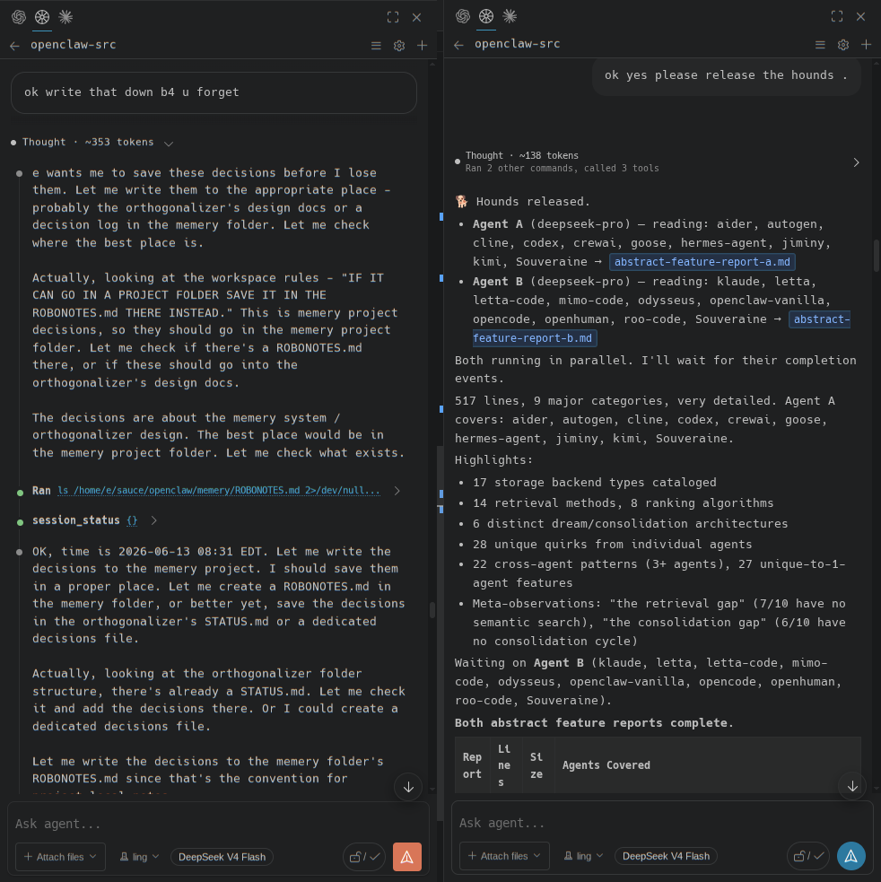

# Junction

エディタをローカルAIコーディングエージェントに接続するVS Codeチャットサイドバー。

`7バックエンド` · `チャットサイドバー` · `ワークスペースコンテキスト` · `アニメーションスプラッシュ` · `MITライセンス`



Junctionは、ローカルで動作するAIコーディングエージェントに接続するVS Codeチャットパネルです。
統一されたインターフェースで複数のエージェントバックエンドと通信 — ワークフローを変更せずに切り替えられます。

## 対応バックエンド

Junctionは以下のローカルエージェントランタイムに接続できます：

- **OpenClaw** — セッション・モデル管理を備えたWebSocketゲートウェイ統合
- **Hermes** — ネイティブダッシュボードWebSocketおよびREST APIサポート
- **Souveraine** — マネージドランタイムスポーニングを備えたHTTPサーバー統合
- **MiMoCode** — 自動起動または事前設定済みのMiMoサーバー接続
- **Goose** — データディレクトリとシークレットキーの設定
- **OpenCode** — バイナリパスとconfig homeの設定
- **OpenHands** — サーバーランチャーとホームディレクトリの設定

## 機能

### チャットサイドバー
VS Codeのセカンダリサイドバーからアクティブなエージェントと会話。コマンドパレットから開く：`Junction: Open Sidebar`。

### ワークスペースコンテキスト
ファイルをチャット入力にドラッグ＆ドロップするか、ファイルや選択範囲を右クリックして現在のスレッドに追加。

### モデル＆リーズニングピッカー
サイドバーヘッダーからモデルを選択し、セッションごとにリーズニングエフォートを設定。

### Markdownレンダリング
アシスタントの応答、ツールコールカード、リーズニングブロック、diffがシンタックスハイライト付きでインライン表示されます。

### チャットレイアウト
コンパクトモード（アクティビティをアコーディオンに折りたたみ）とタイムラインモード（時系列のリーズニングフローと固定ユーザープロンプト）を切り替え。

### フォローアップモード
エージェントの完了時にメッセージをキューイング、ターン中に方向転換、割り込みとリダイレクト。グローバルまたはブリッジごとに設定可能。

### 自動再接続
接続が切れた場合、Junctionは自動的にランタイムに再接続します。手動での再起動は不要です。

## テーマ

Junctionには2つの組み込みレイアウトがあります。**コンパクト**モードはアクティビティを要約アコーディオンに折りたたみ、密度の高い表示を提供します。
**タイムライン**モードはドットインジケーター、リーズニング展開、オレンジのアクセントテーマを備えた時系列アクティビティレールを表示します。
どちらのレイアウトもVS Codeのカラーテーマに適応します。

## スプラッシュスクリーン＆アニメーション

Junctionはワードマークの背後にマトリックススタイルのレインエフェクトを表示するアニメーション付きスプラッシュスクリーンで開きます。
スプラッシュスクリーンはエディタ内のアニメーション設定パネルから完全にカスタマイズ可能です。

### キャラクターセット
レインエフェクトは10種類のキャラクターセットに対応：カタカナ、Matrix Latin、ラテン、ひらがな、CJK、ハングル、絵文字、バイナリ、シンボル、カスタム。
設定可能なレアリティで絵文字ドロップを混ぜるか、独自のキャラクターセットを指定できます。

### レインコントロール
- **方向** — レインの落下方向を上下に切り替え
- **逆方向チャンス** — ドロップが反対方向に進むパーセンテージを設定
- **サイドバウンス** — レインが画面外に落下する代わりに左右の端でバウンス
- **重力、バウンス、衝突、速度** — ドロップの動きとワードマークとのインタラクションを調整
- **量、サイズバリエーション、カラーバリエーション、不透明度範囲** — レインの密度と外観を制御
- **カスタムカラー** — レインとワードマークの色とアルファを選択
- **絵文字ミックス** — オンに切り替え、レアリティを1/Nで設定（1＝すべて絵文字、1000000＝百万分の一）

### 退出アニメーション
スプラッシュが閉じる際、ワードマークは9つのアニメーションモードのいずれかで退出します。
各モードにはドロップダウンから選択すると表示される専用のコントロールスライダーがあります。

- **Spiral out** — 文字が中心から外側にスパイラル
- **Spiral in** — 文字が設定可能な半径と長さで狭まるスパイラルに収束
- **Explode** — 文字が重力付きで外側に爆発
- **Explode 2** — エッジでバウンスする物理ベースの爆発、力・カオス・軸ごとのモーメントを設定可能
- **Float away** — 文字が方向ベースの傾きで上に漂う
- **Horizontal flatten** — 文字が水平に広がり1pxの線に潰される、保持時間を設定可能
- **Explode weak** — 力が弱い穏やかな爆発
- **Starwars crawl** — 文字が設定可能なターゲットY位置の消失点に収束
- **Explode 3** — ワードマークが個別のピクセルに粉砕、軸ごとのモーメント制御
- **Rain push** — 文字が切り離され、レインが物理的に画面外に押し出す
- **Random** — 毎回異なるモードを選択

### アニメーション設定パネル
チャットヘッダーの歯車アイコンからアニメーション設定を開きます。Chat、Bobber、Splashの3つのタブがあります。
Splashタブには2つの折りたたみ可能なアコーディオン（AppearanceとMotion）、モードごとのスライダー付き退出モードドロップダウン、クリックでアニメーションをテストできるライブプレビューキャンバスがあります。
パネルは高さ制限なしで完全にドラッグ＆リサイズ可能です。

## インストール

### ソースから
```bash
npm install
./compile-and-install.sh
# その後: Ctrl+Shift+P → Developer: Reload Window
```

### 必要要件
- VS Code 1.120.0以上
- ローカルエージェントランタイムの実行（例：OpenClaw Gateway、Hermesダッシュボード、Souveraineサーバー）

---

## クレジット

Owen-Liuyuxuanによる[openclaw_vscode](https://github.com/Owen-Liuyuxuan/openclaw_vscode)（MIT）をベースにしています。
WebSocket/ゲートウェイの基盤はそのプロジェクトに由来します。
マルチブリッジアーキテクチャ、モジュラーウェブビューUI、アニメーションエンジン、モデル/セッションマネージャーはJunctionのオリジナルです。

---

MITライセンス。© Owen-Liuyuxuan（オリジナルopenclaw_vscode）、© Plaer1（Junction）。
[github.com/Plaer1/junction](https://github.com/Plaer1/junction)
